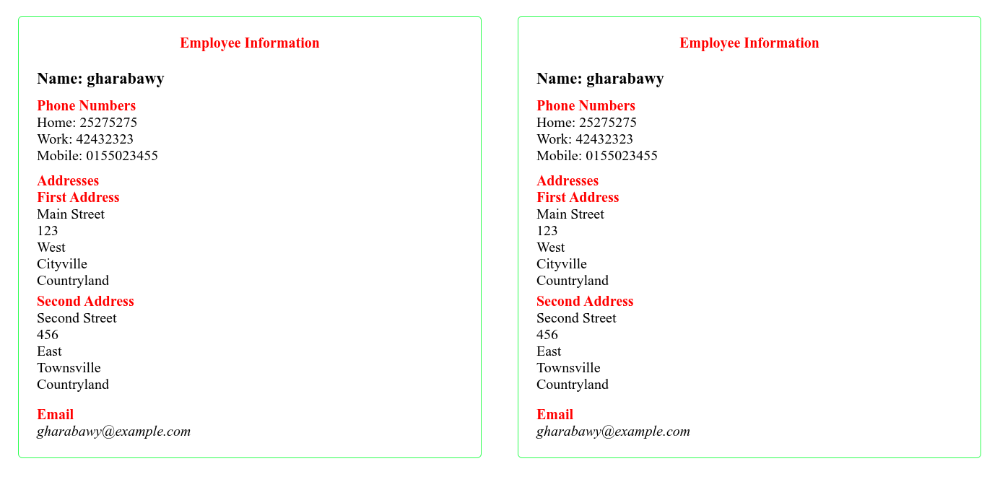

# Employee Contacts File Design

This README outlines the structure and design of a contacts file for employees along with an example output image.

## Contact Information Structure

The contact information for each employee consists of the following elements:
- Name
- Phones
- Addresses
- Email

### Phones
- The `Phones` element may contain multiple `Phone` elements.
- Each `Phone` element has one attribute called `Type`, which can be one of the following values: `home`, `work`, or `mobile`.

### Addresses
- The `Addresses` element may contain multiple `Address` elements.
- Each `Address` element must consist of the following sub-elements:
  - Street
  - Building Number
  - Region
  - City
  - Country

### Email
- The `Email` element must exist for all employees.

## Output Image

## Conclusion

This README provides guidelines for designing a contacts file for employees, including the structure of the data and necessary elements.
