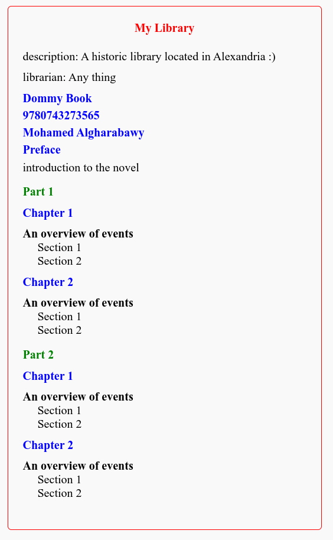

# Library Configuration File Design

This README outlines the structure and design of a configuration file for a library along with an example output image.

## Library Information Structure

The information for the library consists of the following elements:
- Location
- Description
- Librarian
- Books

### Books
- The `Books` element contains multiple `Book` elements.
- Each `Book` element has the following sub-elements:
  - Title
  - ISBN
  - Author
  - Preface
  - Parts

### Parts
- Each `Book` contains multiple `Part` elements.
- Each `Part` element has the following sub-elements:
  - Title
  - Chapters

### Chapters
- Each `Part` contains multiple `Chapter` elements.
- Each `Chapter` element has the following sub-elements:
  - Title
  - Summary
  - Sections

### Sections
- Each `Chapter` contains multiple `Section` elements.
- Each `Section` element contains the content of the book as paragraphs.

## Output Image

## Conclusion

This README provides guidelines for designing a configuration file for a library, including the structure of the data and necessary elements.
